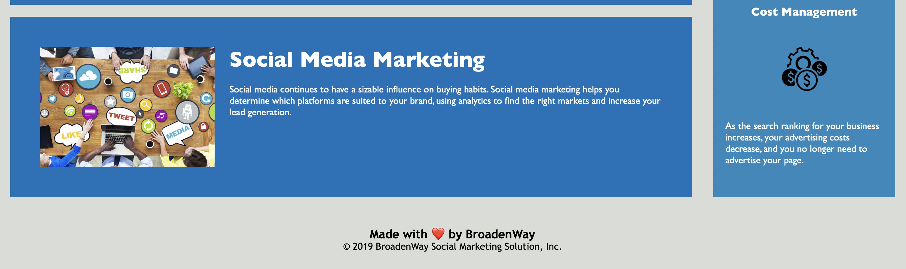

# BroadenWay
Social Marketing Solution

## Description

BroadenWay is a marketing agency dedicated to helping businesses broaden their horizons by increasing brand exposure, engaging new customers, tailoring social media strategies, and managing online reputation.

This project was created to improve the code base of BroadenWay's website and make it more user-friendly. It ensures that the website is optimized for search engines, follows accessibility standards, and preserves its original design.

## Installation

You can access Broadenway's website by clicking on the link below:

```
https://larigens.github.io/broadenway/
```

## Visuals




## Usage

For a complete experience, use the links located in the navigation bar to guide you to a more descriptive section where it shows you all the services offered by BroadenWay and what each one means.

## Contributing

Only authorized employees should create Pull Requests, but we welcome suggestions, so please feel free to create an issue so we can continue to improve!

## Credits

N/A

## License

Please refer to the [LICENSE] (https://choosealicense.com/licenses/mit/) in the repo.


