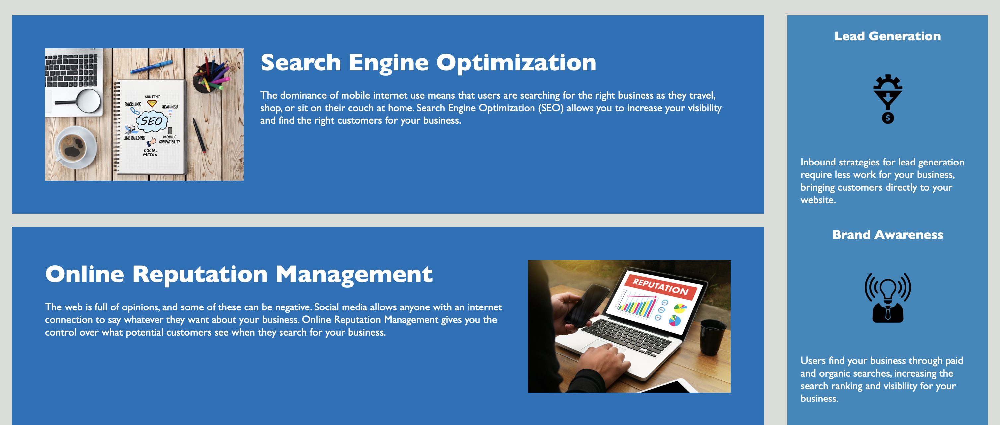

<h1 align="center"> BroadenWay </h1>

  <i>Social Marketing Solution</i>
   

  

  <a href="https://larigens.github.io/broadenway/"><strong>BroadenWay</strong></a>
   

 

---
## Description

BroadenWay is a marketing agency dedicated to helping businesses broaden their horizons by increasing brand exposure, engaging new customers, tailoring social media strategies, and managing online reputation.

This project was created to improve the code base of BroadenWay's website and make it more user-friendly. It also ensures that the website is optimized for search engines, follows accessibility standards, and preserves its original design.

## Table of Contents
- [Description](#description)
- [Table of Contents](#table-of-contents)
- [Mock-Up](#mock-up)
- [Usage](#usage)
- [Questions](#questions)
- [Contributions](#contributions)
  - [Contributing Guidelines](#contributing-guidelines)
  - [Code of Conduct](#code-of-conduct)
- [Credits](#credits)
  - [Acknowledgements](#acknowledgements)
  - [Links](#links)
- [License](#license)

## Mock-Up

The following images shows the web application's appearance and functionality:

## Usage

The links in the navigation bar lead you to more detailed sections of this site, where you will find information about BroadenWay's services.

## Questions

For questions and support please <a href="mailto:larigens@gmail.com">email me</a>!

## Contributions
### Contributing Guidelines

Want to report a bug, contribute some code, request a new feature, or improve the documentation? You can submit an issue and I will gladly welcome you as a contributor, but before submitting an issue, please search the issue tracker, as it may already exist!

**_Only_ authorized users should create pull requests.**

### Code of Conduct

Our Code of Conduct follows the same principles as the [Contributor Covenant](https://www.contributor-covenant.org/version/2/1/code_of_conduct/), version 2.1.

## Credits

### Acknowledgements

Resources used during the development of this project:

- [Make a README](https://www.makeareadme.com)

- [W3 Schools](https://www.w3schools.com)

- [MDN](https://developer.mozilla.org/en-US/)

### Links

## License

Please refer to the [LICENSE](https://choosealicense.com/licenses/apache-2.0/) in the repo.
